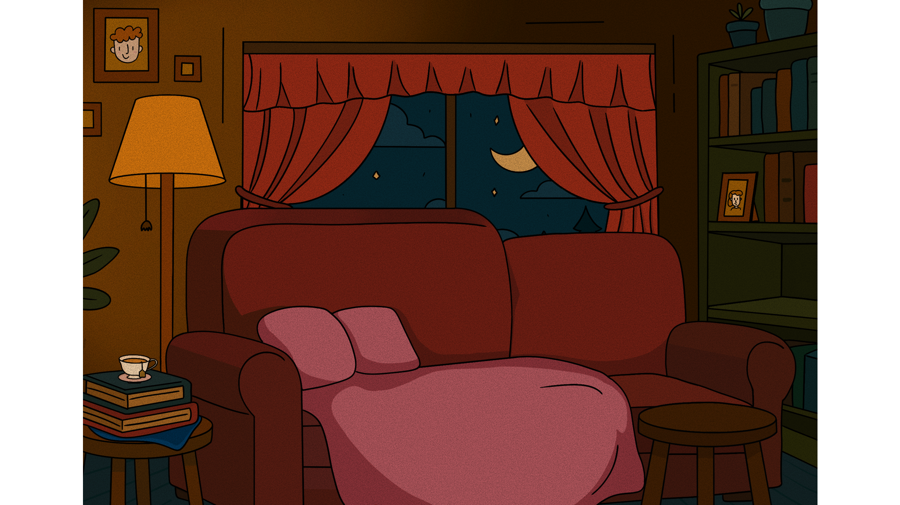

# 💲Grand!Scam💲
## Juegos Serios 2025/2026 - 3ºV GDV - V.3.0
### Nombre del grupo: UNDERGROUND
### Sergio Naranjo Barroso y Jule Page Galocha
#### 💥Página Web💥
https://julepage.github.io/GrandScam-JuegosSerios/

## Descripción
Grand!Scam es un juego serio educativo cuyo objetivo es enseñar a adultos y personas mayores a reconocer estafas digitales.
El jugador encarna a una persona mayor sentada en el sofá de su casa. A lo largo de la partida recibe llamadas y mensajes sospechosos y debe tomar decisiones seguras, identificando si se trata de una estafa o de una situación legítima.
El objetivo consiste en reconocer señales comunes de phishing y estafas online y aumentar la confianza frente a amenazas tecnológicas.

