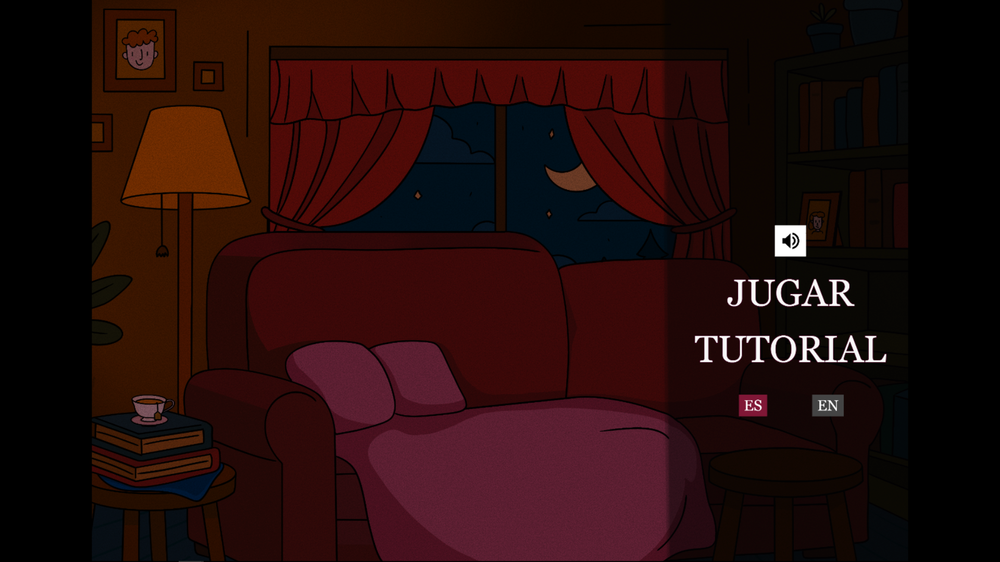
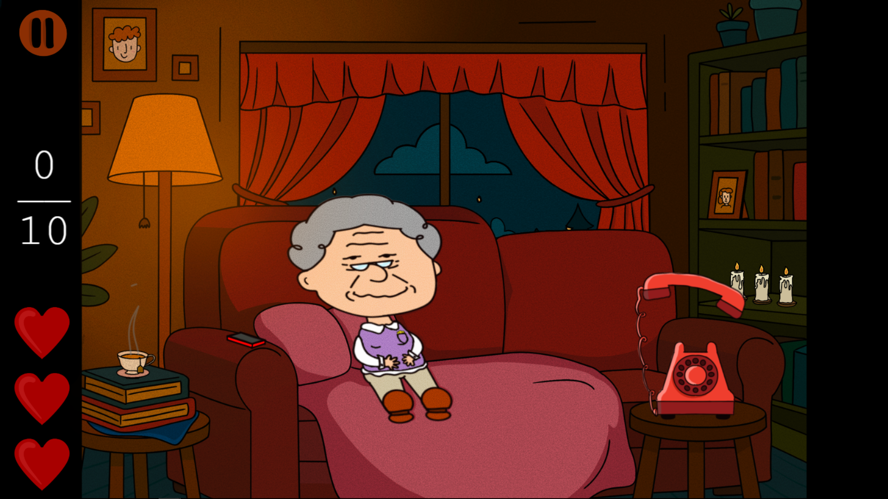
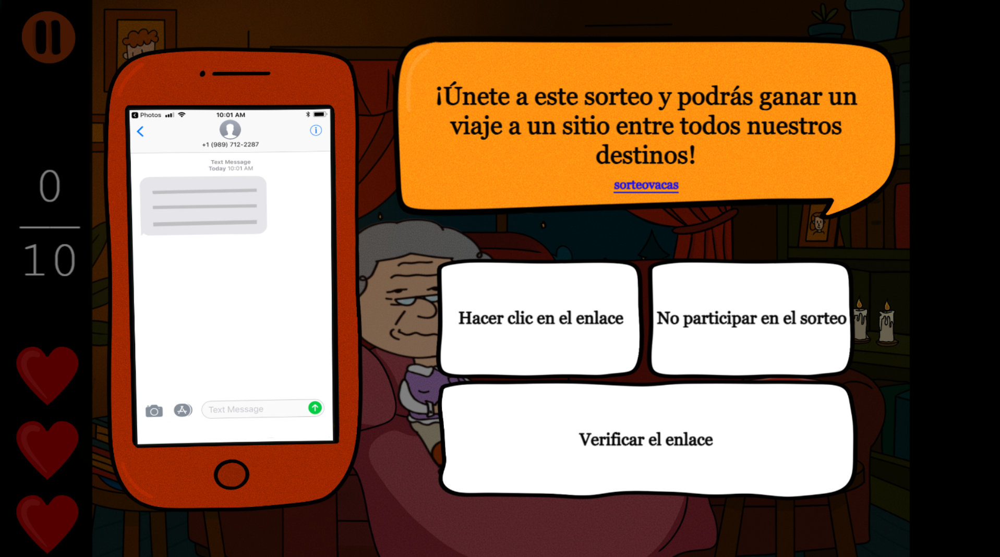

# 💲Grand!Scam💲
## Juegos Serios 2025/2026 - 3ºV GDV - V.3.0
### Nombre del grupo: UNDERGROUND
### Sergio Naranjo Barroso y Jule Page Galocha
#### 💥Página Web, clic para jugar💥
https://julepage.github.io/GrandScam-JuegosSerios/
#### 💥Página Web Tracker💥
https://sb.e-ucm.link/GrandScam
El juego con el tracker está en otra rama, para que los usuarios puedan probarlo sin iniciar sesión está el primer enlace. Para ver el cuestionario mira el GDD y para ver la programación del tracker, cambia de rama.
##### Usuarios para el tracker:
pcke /
sufz /
nfec /
zziz /
gzla /
nzfh /
rtyg / 
nmwc /
snas /
vsvr /
qbrv /
ktll /
wljq /
gtjq

Si no funciona con uno de los usuarios prueba con otro.
## Descripción
Grand!Scam es un juego serio educativo cuyo objetivo es enseñar a adultos y personas mayores a reconocer estafas digitales.
El jugador encarna a una persona mayor sentada en el sofá de su casa. A lo largo de la partida recibe llamadas y mensajes sospechosos y debe tomar decisiones seguras, identificando si se trata de una estafa o de una situación legítima.
El objetivo consiste en reconocer señales comunes de phishing y estafas online y aumentar la confianza frente a amenazas tecnológicas.

